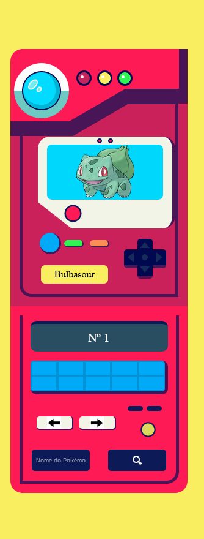

<h1 align='center'>Pokédex</h1>

<h2>📋 Sobre o projeto</h2>

Projeto criado para por em pratica meus conhecimentos em css e javascript.

 <h2 id="techs"> 💻 Tecnologias</h2>
 
- [HTML]()
- [CSS]()
- [JavaScript]()

<h2>🚀 Api</h2>

- [PokéApi](http://pokeapi.co/)
- [Pokeres](https://pokeres.bastionbot.org/)

<h2>🎨 Layouts</h2>
<h3>Loading</h3>

<h3>Web:</h3>

<h3>Mobile:</h3>

 <h2 id="autor"> 🦸 Autor</h2>

[Rodrigo-Souza-Dev](https://github.com/Rodrigo-Souza-DEV)

<h2 id="licenca"> ⚠️  Licença</h2>

Esse projeto esta sobre a licença [MIT](https://github.com/Rodrigo-Souza-DEV/Pokedex/blob/master/LICENSE).

Feito por Rodrigo Souza.

<h2>Acesse a Pokedex <a href="https://rodrigo-souza-dev.github.io/Pokedex/">Aqui</a></h2>
